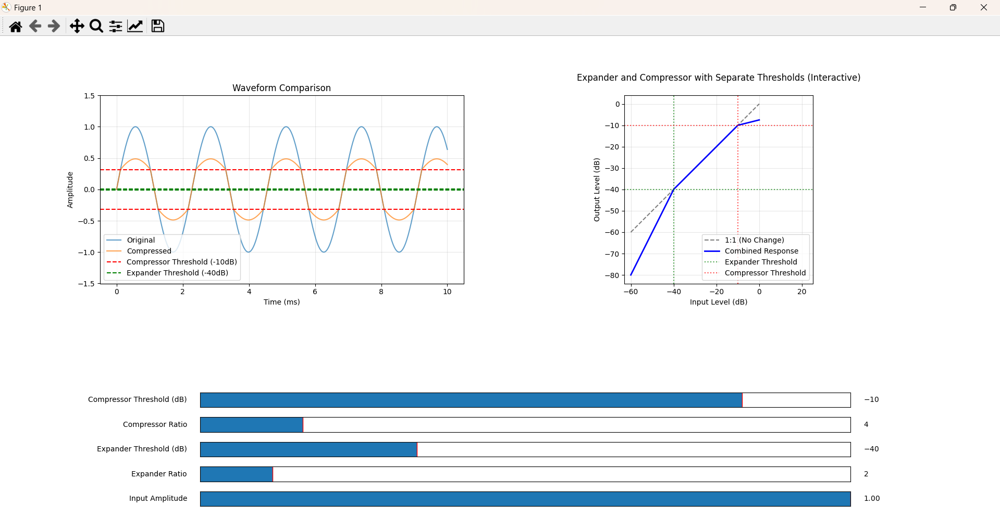
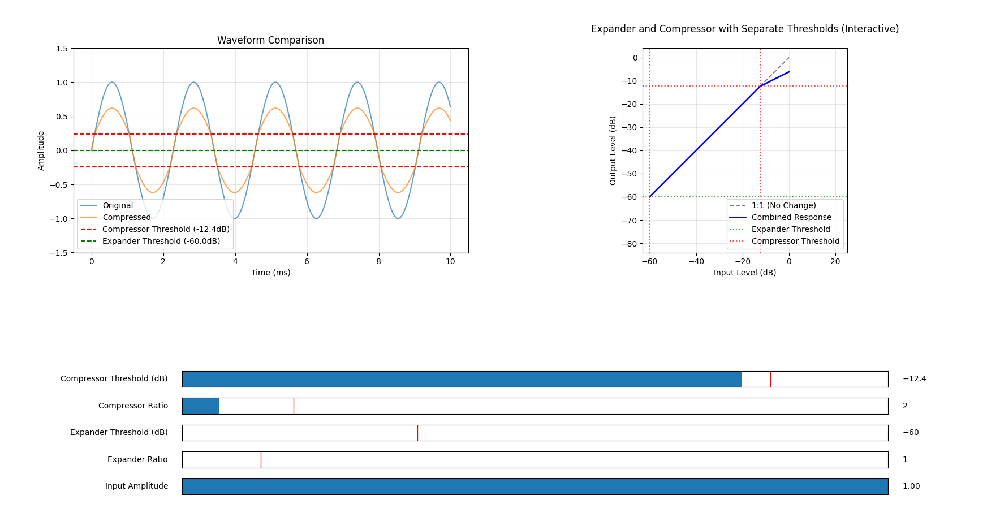
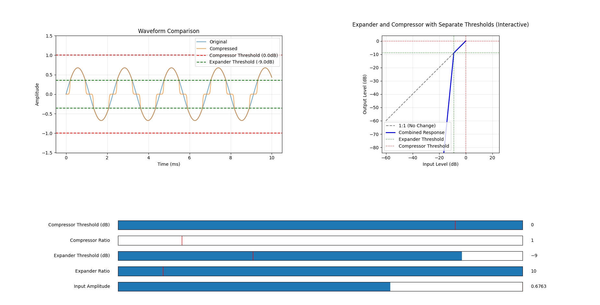
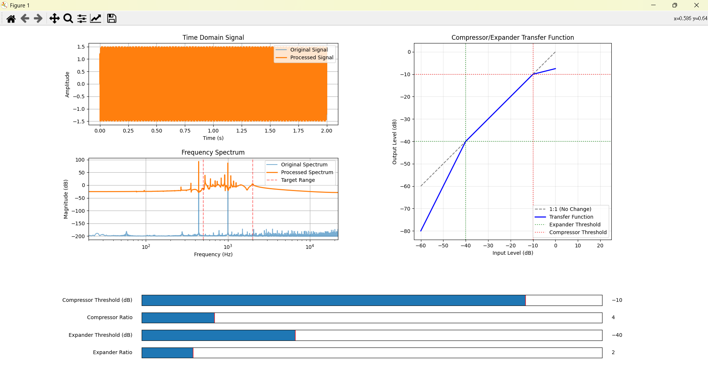
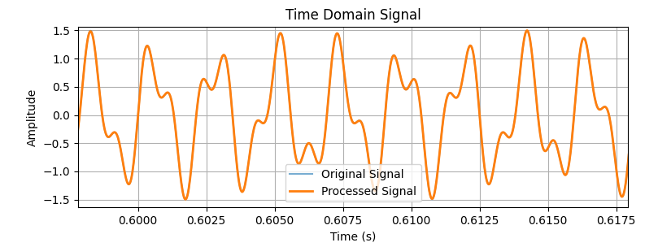

# Audio-EQ-and-Compressor
The python files create simple audio equalizers and compressors for the users to gain more insights in audio tuning.

## How to run and use the python code ?
1. Please pip install the following in your visual studio code terminal:
    1. *pip install numpy*
    2. *pip install matplotlib*
    3. *pip install scipy*
2. Simply download the three python files and run them on visual studio code.
    * Select a python file that you are interested in.
    * Select **Run Python file** in your visual studio code editor.
    * After a few seconds, a UI would pop up.
    * Play around with the sliders and have some fun in changing the signals.

##  Audio tuning basics
### Audio Equalizer Walk through
The file you need: *Audio_Equalizer.py*.
Audio equalizers are also called audio eq. 
The tool allows specific gain control over selected frequencies.

The above UI is what you will see when executing the *Audio_Equalizer.py* file. The first graph is the **EQ graph**, the second graph is the **time domain graph**, the third graph is the **frequency domain graph**. The bottom three sliders are the **gain controller**, **center frequency controller**, and the **q factor controoler**.

##### gain controller
The gain controller allows the user to control the gain at a desired frequency. In the below example, the user introduced -3.84 dB of gain at 1 kHz frequency. This caused the amplitude of the original sine wave to shrink a little. Further more, in the frequency domain, the magnitude of the peak at 1 kHz also redued by 3.84 dB. Isn't this cool~

##### center frequency controller
The center frequency controller allows the user to choose which frequency should the gain take effect. In the below example, the user moved the negative gain to 2 kHz. This made the sine wave return back to its original amplitude. This made sense because we don't have frequencies other than 1 kHz. 

##### q factor controoler
The q factor allows the user to control how *fat* the EQ curve should be. The smaller the q factor the fatter the EQ curve. In the below example, the user move the negative gain to 800 Hz, but the sine wave is still attenuated. How could this be ? The reason is that the EQ curve is too *fat*. Hence, a partial of the EQ curve still affects the 1 kHz sine wave.

By increasing the q factor, the EQ curve became *slimmer*, and the 1 kHz sine wave is not affected.

It should be noted that the wideness EQ curve depends how you want your audio to sound. **There is no strict rule on how wide the EQ curve should be**. Play around the sliders and gain some understanding of audio EQ.

### Audio compressor walk through
The file you need: *Audio_compressor_and_expander.py*.

The tool allows granular wave shape control on audio signals.

The above the UI you would see when you execute the *Audio_compressor_and_expander.py* file. The left graph is the time domain window the right graph is the compressor and expander function. The slide bars are the parameters that controls the compressor and expander function.

#### Compressor
A compressor "compresses" a signal when the input signal exceeds a given threshold (The dynamic range is *compressed*.). Signal that is above the threshold would be attenuated. Signal that is below the threshold would not be affected. In the below example, the user move the threshold to -12.4 dB and set the ratio to 2. This means that signal that is above -12.4 dB would be attenuated with a ratio that equals to 2. We can see that signal above the red dash line, the blue sine wave has an amplitude two times the magnitude of the compressed signal.

In most audio tuning cases, compressors are used to reduce the largest sound.

#### Expander 
An expander "expands" a signal when the input signal falls below a given threshold (The dynamic range is *expanded*). Signal that exceeds the threshold would not be affected. In the below example, the threshold is set to -9 dB and the ratio is set to 10. This means that signal amplitude that lies below -9 dB would be attenuated. We can see the attenuation in the time domain graph.

In most audio tuning cases, expanders are used to remove unwanted "small" noise.

*Note that in most audio tuning scenarios, the threshold of the compressor is often set above -20 dB and the threshold of the expander is often set lower than -40 dB and the ratios are set smaller than 4 to avoid sound (signal) distortion*.

Play around with the slide bars and see that would happen when compressor and expander functions are combined together.

## Specific band compressor
The file you need: *Specific_band_audio_compressor_and_expander.py*. 
Audio compressors also allow users to ajust specific frequency ranges. These types of compressors are called *multiband dynamic range compressor* or *MBDRC* for short. The below UI is the MBDRC-like UI. Currently, it has only two bands and the user could only adjust only one band. So it is sort of like a MBDRC.
 
The user could only adjust the frequency band between the red dash lines. Also, if you feel that the signal in the time domain plot is too crouded, use the magnifying glass tool to zoom in.

After zooming in, we could see that the signal is not a perfect sine wave. Instead it is actually consits of a 440 Hz sine wave and a 1000 Hz sine wave. The user is encouraged to try to remove the 1 kHz sine wave and make the signal in the time domain looks "cleaner".

Hint: Try reducing the 1 kHz sine wave through adjusting the threshold and the ratio.

#### By going through the three exercises, the user should gain more knowledge in how basic audio tuning works.
