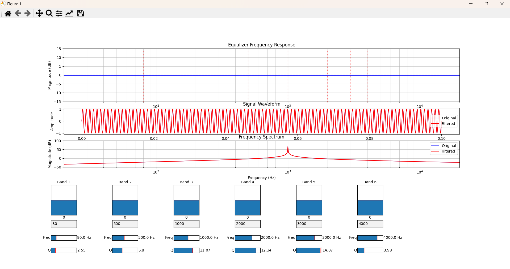
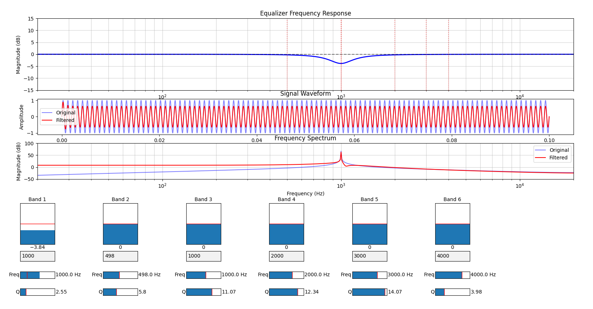
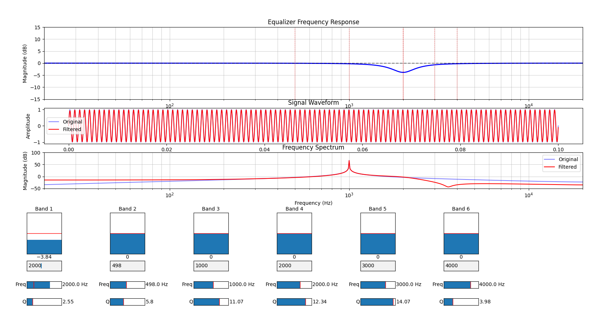
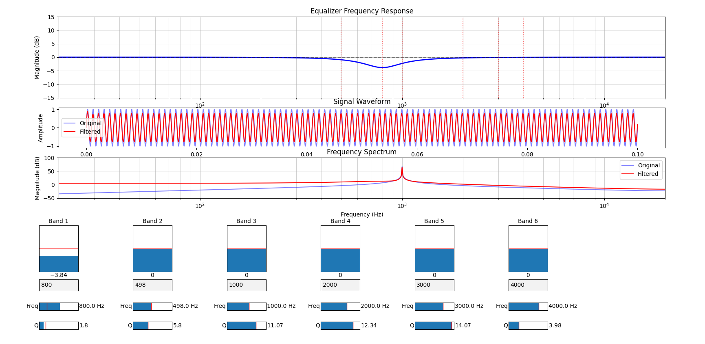
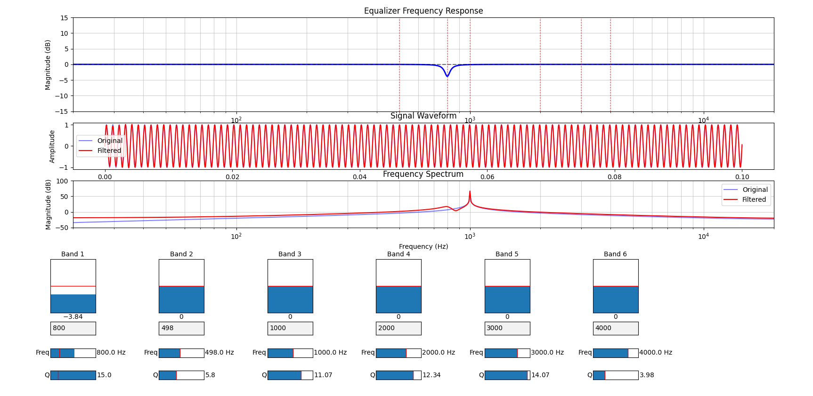

# Audio-EQ-and-Compressor
The python files create simple audio equalizers and compressors for the users to gain more insights in audio tuning.

## How to run and use the python code ?
1. Please pip install the following in your visual studio code terminal:
    1. *pip install numpy*
    2. *pip install matplotlib*
    3. *pip install scipy*
2. Simply download the three python files and run them on visual studio code.
    * Select a python file that you are interested in.
    * Select **Run Python file** in your visual studio code editor.
    * After a few seconds, a UI would pop up.
    * Play around with the sliders and have some fun in changing the signals.

##  Audio tuning basics
### Audio Equalizer Walk through
The file you need: *Audio_Equalizer.py*
Audio equalizers are also called audio eq. 
The tool allows specific gain control over selected frequencies.

The above UI is what you will see when executing the *Audio_Equalizer.py* file. The first graph is the **EQ graph**, the second graph is the **time domain graph**, the third graph is the **frequency domain graph**. The bottom three sliders are the **gain controller**, **center frequency controller**, and the **q factor controoler**.

##### gain controller
The gain controller allows the user to control the gain at a desired frequency. In the below example, the user introduced -3.84 dB of gain at 1 kHz frequency. This caused the amplitude of the original sine wave to shrink a little. Further more, in the frequency domain, the magnitude of the peak at 1 kHz also redued by 3.84 dB. Isn't this cool~

##### center frequency controller
The center frequency controller allows the user to choose which frequency should the gain take effect. In the below example, the user moved the negative gain to 2 kHz. This made the sine wave return back to its original amplitude. This made sense because we don't have frequencies other than 1 kHz. 

##### q factor controoler
The q factor allows the user to control how *fat* the EQ curve should be. The smaller the q factor the fatter the EQ curve. In the below example, the user move the negative gain to 800 Hz, but the sine wave is still attenuated. How could this be ? The reason is that the EQ curve is too *fat*. Hence, a partial of the EQ curve still affects the 1 kHz sine wave.

By increasing the q factor, the EQ curve became *slimmer*, and the 1 kHz sine wave is not affected.

It should be noted that the wideness EQ curve depends how you want your audio to sound. **There is no strict rule on how wide the EQ curve should be**. 

